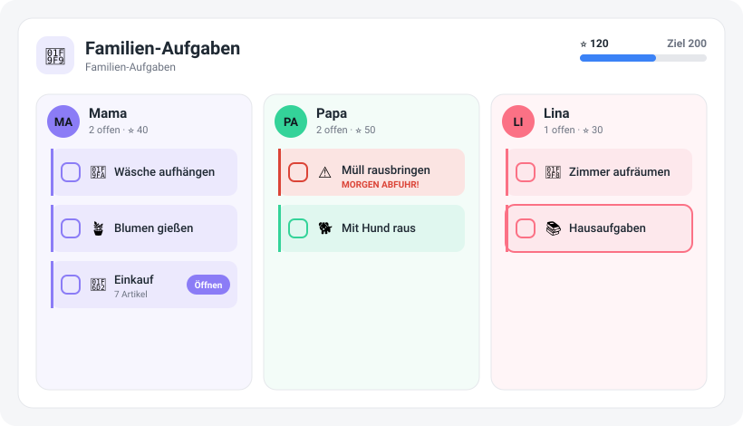

# 🧹 Family Task Card



> **Status: nutzbar (v0.4.1).** Personen-Board, visueller Editor, Kinder-Modus,
> Bring!-Einkauf, Kontext-Aufgaben, Belohnungs-Shop und Feier-Aktionen (Erfolg
> über Licht/Sound/TTS/Push fühlbar machen) sind da – responsiv für iOS/Android.
> Die Karte liest `todo.*`-Listen live und schreibt beim Abhaken zurück – siehe
> [ROADMAP.md](ROADMAP.md).

Eine **gamifizierte Familien-Aufgaben-/Ämtli-Karte** für
[Home Assistant](https://www.home-assistant.io/) – für Erwachsene und Kinder
spielerisch bedienbar, im Look der
[Family Board Card](https://github.com/renespeaker/ha-family-board-card) und
**theme-aware** (nutzt durchgehend HA-CSS-Variablen, passt sich also dem
Dashboard-Theme an).

## Idee

Aufgaben pro Person – mit Avataren aus den `person.*`-Entitäten, Farbe je
Familienmitglied, Punkten und Belohnungen. **Provider-übergreifend**, weil die
Karte auf Home Assistants `todo.*`-Entities aufsetzt: Apple Erinnerungen,
Todoist, Google Tasks, Bring! und lokale To-do-Listen liefern alle solche
Entities – Abhaken in der Karte hakt die Aufgabe **bidirektional** auch in der
Quell-App ab. Kein separater Cloud-Account für Kinder nötig, alles läuft in HA.

## Geplante Funktionen

- **Aufgaben pro Person** – Spalten mit Avatar, Farbe, Punkten; Kacheln mit
  Emoji und `border-left`-Akzent wie die Termin-Chips der Family Board Card.
- **Kinder-Modus** – große, bunte Kacheln, Antippen = erledigt, Sterne &
  Belohnungsziel; auch für Kinder, die noch nicht lesen.
- **Belohnungs-Shop mit Eltern-Freigabe** – Punkte → Taschengeld / Bildschirm­zeit /
  Wunsch; Kind löst ein, Eltern bestätigen (optional mit Foto-Beweis).
- **Kontext-Aufgaben (HA-Superkraft)** – reagieren auf Kalender, Wetter &
  Anwesenheit (z. B. „Müll" am Abfuhr-Vorabend, „Gießen" bei Regen überspringen,
  Eskalations-Push wenn nicht rechtzeitig erledigt).
- **Kiosk-Modus** – fürs Wandtablet; Erfolg wird über HA fühlbar (Licht wird
  grün, Sound, TTS-Ansage, Eltern-Push).
- **Einkaufen mit Bring!** – der ganze Einkauf als eine zugewiesene Aufgabe mit
  Punkten; Push öffnet die Bring!-App, Artikel-Abhaken synchron.
- **Am Handy einrichten** – Aufgaben, Zuständige, Punkte & Wiederholung per UI.

Details, Reihenfolge und Roadmap-Themen (Auto-Rotation „reihum", Einzel-Item-
Zuweisung, Geofence, Level/Avatare …) in [ROADMAP.md](ROADMAP.md).

## Synergie mit der Family Board Card

Gleiche Design-Sprache und dieselben `person.*`-Entities: die Aufgaben können
neben – oder perspektivisch in – der Family Board Card erscheinen. Ein Look,
eine Bedienung.

## Plattformen & Provider (iOS / Android)

Die Karte läuft überall, wo Home Assistant läuft – im Browser und **in der HA-
Companion-App auf iPhone/iPad und Android**. Das Layout ist **responsiv**: auf
dem Handy stapeln sich die Personen-Spalten, Bedien­elemente sind touch-groß, der
Kinder-Modus ist fürs Wandtablet gemacht.

Weil die Karte auf `todo.*`-Entities aufsetzt, ist sie **provider- und plattform-
übergreifend** – die jeweilige HA-Integration liefert die Liste:

| Provider | HA-Integration | Hinweis |
|---|---|---|
| 🍎 **Apple Erinnerungen** | [CalDAV](https://www.home-assistant.io/integrations/caldav/) (iCloud) | iCloud-**App-spezifisches Passwort** nötig; die Erinnerungs-Liste erscheint als `todo.*`. |
| 🤖 **Google Tasks** | [Google Tasks](https://www.home-assistant.io/integrations/google_tasks/) | über Google-Konto. |
| ✅ **Todoist** | [Todoist](https://www.home-assistant.io/integrations/todoist/) | offizielle Integration. |
| 🛒 **Bring!** | [Bring!](https://www.home-assistant.io/integrations/bring/) | Bring!-Account nötig (siehe unten). |
| 📝 **Lokale To-do-Liste** | HA-nativ | kein Konto nötig. |

**Apple Erinnerungen einrichten (Kurz):** In der HA-CalDAV-Integration die
iCloud-CalDAV-URL + Apple-ID und ein **app-spezifisches Passwort**
([appleid.apple.com](https://appleid.apple.com) → Anmeldung & Sicherheit)
angeben; die Erinnerungslisten tauchen dann als `todo.*`-Entities auf und lassen
sich hier pro Person zuordnen. Abhaken in der Karte hakt die Erinnerung auch auf
dem iPhone ab.

**Push/Deep-Links:** Benachrichtigungen (z. B. „Einkauf steht an", „X ist
fertig") verschickst du über `notify.mobile_app_*`; zum Öffnen einer App/URL
nutzt iOS `url`, Android `clickAction` (Beispiel: `examples/bring-push-automation.yaml`).

## Installation

Die Family Task Card ist eine **Lovelace-Karte** (Frontend) – genau wie die
Family Board Card. Es gibt **keine Integration** zum Hinzufügen und **kein
Neustart** nötig.

### Über HACS (empfohlen)

1. HACS → ⋮ → **Custom repositories** → `https://github.com/renespeaker/ha-family-task-card`,
   Typ **Dashboard** (Lovelace).
2. **„Family Task Card"** installieren. HACS legt die Ressource automatisch an.
3. Browser einmal **hart neu laden** (Strg+Shift+R), damit die Karte geladen wird.
4. Dashboard → Karte hinzufügen → nach **„Family Task Card"** suchen.

### Manuell (ohne HACS)

1. `family-task-card.js` aus diesem Repo nach `config/www/` kopieren.
2. Einstellungen → **Dashboards → ⋮ → Ressourcen → Ressource hinzufügen**:
   URL `/local/family-task-card.js`, Typ **JavaScript-Modul**.
3. Browser hart neu laden, dann Karte hinzufügen.

> **Von einer früheren Version als Integration installiert?** Entferne die alte
> „Family Task Card"-Integration unter *Geräte & Dienste* und deinstalliere sie
> in HACS, dann füge das Repo wie oben als **Dashboard** neu hinzu.

## Konfiguration

Die Karte wird pro Person mit einer oder mehreren `todo.*`-Listen konfiguriert –
im selben Stil wie die Family Board Card mit `persons`. Am einfachsten geht das
über den **visuellen Editor** (Karte im Dashboard bearbeiten): Personen
hinzufügen/sortieren, `person.*` & `todo.*`-Listen per Auswahlfeld zuordnen,
Farbe wählen, Punkte & Ziel setzen – funktioniert auch am Handy. Ein Klick auf
**„Personen erkennen"** übernimmt vorhandene `person.*`-Entitäten. Wer lieber
YAML schreibt:

```yaml
type: custom:family-task-card
title: Familien-Aufgaben
points_per_task: 10   # Punkte pro erledigter Aufgabe (Standard 10)
goal: 200             # optionales Familienziel -> Fortschrittsbalken
show_completed: false # erledigte Aufgaben (ausgegraut) mitanzeigen
persons:
  - name: Mama
    person: person.mama          # optional -> Avatar + Anzeigename
    lists: todo.mama_aufgaben     # eine Liste ...
  - name: Papa
    person: person.papa
    lists:
      - todo.papa_aufgaben        # ... oder mehrere
      - todo.einkauf_bring
  - name: Lina
    color: "#FB7185"              # optionaler Farb-Override
    lists: todo.lina_aemtli
```

| Option            | Typ                | Beschreibung                                             |
|-------------------|--------------------|---------------------------------------------------------|
| `persons`         | Liste (Pflicht)    | Familienmitglieder; je Person `name`/`person`/`lists`.  |
| `persons[].lists` | Entität(en)        | `todo.*`-Entität(en), die zu dieser Person gehören.     |
| `persons[].person`| `person.*`         | optional – liefert Avatar & Anzeigename.                |
| `persons[].color` | Farbe              | optional – überschreibt die Palette.                    |
| `persons[].points_entity` | `input_number` | Guthaben-Helfer (eingelöste Punkte) für den Shop.  |
| `title`           | Text               | Kartentitel.                                             |
| `points_per_task` | Zahl               | Punkte je erledigter Aufgabe (Standard 10).             |
| `goal`            | Zahl               | Familien-Punkteziel → Fortschrittsbalken.               |
| `show_completed`  | Bool               | erledigte Aufgaben ausgegraut mitanzeigen.              |
| `kid_mode`        | Bool               | großes, tippbares Kinder-Layout (Avatar-Umschalter).    |
| `shopping_lists`  | Entität(en)        | `todo.*`-Listen (z. B. Bring!) als eine „Einkauf"-Kachel. |
| `shopping_points` | Zahl               | Punkte für einen erledigten Einkauf (Std. = pro Aufgabe). |
| `bring_deeplink`  | Text               | Ziel des „In Bring! öffnen"-Buttons (Std. web.getbring.com). |
| `highlight_overdue` | Bool             | überfällige Aufgaben als dringend markieren (Std. an).  |
| `context_rules`   | Liste              | Regeln, die auf HA-Zustände reagieren (siehe unten).    |
| `rewards`         | Liste              | Belohnungen für den Shop (`name`, `cost`, `emoji`).     |
| `parent_pin`      | Text/Zahl          | PIN für die Eltern-Freigabe beim Einlösen.              |
| `celebrate`       | Objekt             | HA-Services bei Erfolg (Licht/Sound/TTS/Push, siehe unten). |

### Kinder-Modus

Mit `kid_mode: true` zeigt die Karte ein **großes, tippbares Einzel-Kind-Layout**
fürs Wandtablet: oben ein Avatar-Umschalter (wer ist dran?), darunter XL-Kacheln
mit Emoji, ein Punkte-/Ziel-Balken und ein kurzes Konfetti-Feedback beim Abhaken.
Ideal als eigene Karte auf einem Kinder-Dashboard, während das volle Board für
die Eltern bleibt.

### Einkaufen mit Bring!

> **Voraussetzung:** Für die Bring!-Nutzung brauchst du die
> [**Bring!-Integration**](https://www.home-assistant.io/integrations/bring/) in
> Home Assistant und einen **Bring!-Account** beim Anbieter (die kostenlose
> Bring!-App). Die Integration stellt deine Bring!-Liste als `todo.*`-Entity
> bereit – die diese Karte dann verwendet. Ohne Bring! funktioniert die Karte
> normal mit allen anderen `todo.*`-Listen.

Listen unter `shopping_lists` (z. B. eine Bring!-Liste aus der HA-Bring-
Integration) werden **als eine „Einkauf"-Kachel** dargestellt: 🛒 + Anzahl der
Artikel + ein **„In Bring! öffnen"**-Button. Antippen der Kachel erledigt den
ganzen Einkauf – jeder offene Artikel wird abgehakt und **synchron zurück in die
Quell-Liste** geschrieben. Für einen erledigten Einkauf gibt es `shopping_points`.

```yaml
type: custom:family-task-card
shopping_lists: todo.einkauf_bring
shopping_points: 20
# bring_deeplink: "https://web.getbring.com"   # optional
persons:
  - name: Papa
    person: person.papa
    lists:
      - todo.papa_aufgaben
      - todo.einkauf_bring    # dieselbe Liste der Person zuweisen -> zählt für sie
```

Den **Push aufs Handy**, der Bring! direkt öffnet, übernimmt eine Home-
Assistant-Automation (nicht die Karte) – eine fertige Vorlage liegt unter
[`examples/bring-push-automation.yaml`](examples/bring-push-automation.yaml).

> Hinweis: Einen offiziellen Deep-Link auf eine *bestimmte* Bring!-Liste gibt es
> öffentlich nicht; der Button öffnet Bring! allgemein. Die Punkte für Einkäufe
> werden aktuell live aus dem Listenzustand geschätzt – eine echte Punkte-
> Historie kommt laut Roadmap mit einem optionalen Backend.

### Kontext-Aufgaben

Die HA-Superkraft: Aufgaben **reagieren auf den Zustand deines Zuhauses**
(Wetter, Anwesenheit, Kalender, Sensoren). Zwei Ebenen:

**1. Überfällig automatisch** – Aufgaben mit überschrittenem Fälligkeitsdatum
(`due`) werden ohne Konfiguration als **dringend** markiert (⚠️, roter Akzent,
Chip „Überfällig"). Abschaltbar mit `highlight_overdue: false`.

**2. `context_rules`** – eigene Regeln. Trifft die Bedingung auf `entity` zu,
bekommen passende Aufgaben den `effect`:

- `hide` – ausblenden (z. B. Gießen überspringen, wenn es regnet)
- `highlight` – hervorheben (farbiger Rahmen)
- `urgent` – als dringend markieren (⚠️, z. B. Müll am Abfuhr-Vorabend)

```yaml
type: custom:family-task-card
persons:
  - name: Papa
    lists: todo.haushalt
context_rules:
  # Gießen ausblenden, wenn das Wetter auf Regen steht
  - match: "gieß|blumen|pflanze"
    entity: weather.home
    state: rainy
    effect: hide
  # Müll dringend machen, wenn der Abfuhr-Sensor morgen meldet
  - match: "müll|tonne"
    entity: binary_sensor.muellabfuhr_morgen
    state: "on"
    effect: urgent
    label: "Morgen Abfuhr!"
  # Einkauf hervorheben, wenn jemand unterwegs ist (Anwesenheit)
  - match: "einkauf"
    entity: person.papa
    state: not_home
    effect: highlight
    label: "Du bist unterwegs"
```

Bedingungen je Regel: `state` (ein Wert oder Liste), `above`/`below` (numerisch),
oder ganz ohne → „Zustand ist an/aktiv". `invert: true` dreht die Bedingung um.
Ohne `match`/`lists` gilt die Regel für alle Aufgaben; `lists` schränkt auf
bestimmte `todo.*`-Listen ein.

> Die **Eskalations-Push** („nicht rechtzeitig erledigt") ist – wie bei Bring! –
> eine HA-Automation, nicht Kartencode. Die Karte macht die **sichtbare**
> Eskalation (Dringend-Markierung); den Push kannst du an denselben Sensoren
> aufhängen.

### Belohnungs-Shop

Punkte lassen sich gegen **Belohnungen** einlösen – mit **Eltern-Freigabe per
PIN**. Belohnungen definierst du in `rewards`; die PIN in `parent_pin`.

Damit ausgegebene Punkte **dauerhaft** gespeichert werden (auch nach Neuladen/
Neustart), bekommt jede Person einen HA-Helfer **`input_number`**, der die
**bereits eingelösten** Punkte hält. **Guthaben = verdient − eingelöst.**

```yaml
type: custom:family-task-card
parent_pin: "1234"
rewards:
  - { name: "30 Min Tablet", cost: 50, emoji: "📱" }
  - { name: "Eis", cost: 30, emoji: "🍦" }
  - { name: "Kino", cost: 200, emoji: "🎬" }
persons:
  - name: Lina
    lists: todo.lina_aemtli
    points_entity: input_number.lina_eingeloest   # input_number-Helfer anlegen
```

Bedienung: 🎁-Button in der Personen-Spalte (bzw. im Kinder-Modus) öffnet den
Shop. „Einlösen" ist nur aktiv, wenn das Guthaben reicht; danach fragt die Karte
die **Eltern-PIN** ab und bucht bei Erfolg vom `input_number` ab.

> Ohne `points_entity` zeigt der Shop die Belohnungen nur an (Einlösen
> deaktiviert). Der **asynchrone Freigabe-Ablauf** („Kind stellt Antrag, Eltern
> bestätigen später per Push, evtl. mit Foto") kommt laut Roadmap mit einem
> optionalen Backend. Die verdienten Punkte werden live aus dem Listenzustand
> berechnet – siehe Hinweis beim Einkauf.

### Feier-Aktionen (Erfolg fühlbar machen)

Die Karte kann bei Erfolg **beliebige Home-Assistant-Services** aufrufen – so
wird aus einem Häkchen ein kleiner Moment: Licht kurz grün, ein Jingle, eine
TTS-Ansage oder ein Push an die Eltern. Ideal fürs Wandtablet.

```yaml
type: custom:family-task-card
celebrate:
  on: all_done            # all_done | task | reward  (oder eine Liste)
  actions:
    - service: light.turn_on
      data: { entity_id: light.kinderzimmer, rgb_color: [0, 255, 0], brightness_pct: 100 }
    - service: tts.google_translate_say
      data: { entity_id: media_player.kueche, message: "{name} hat alles geschafft!" }
    - service: notify.mobile_app_papa
      data: { message: "{name} ist fertig 🎉" }
persons:
  - name: Lina
    lists: todo.lina_aemtli
```

- **`on`** wählt den Moment: `all_done` (Person hat nichts Offenes mehr –
  Standard), `task` (jede erledigte Aufgabe) oder `reward` (Belohnung eingelöst).
  Mehrere gleichzeitig als Liste möglich.
- **`actions`** ist eine Liste von Service-Aufrufen (`service` + `data`/`target`),
  genau wie in HA-Automationen.
- Platzhalter: **`{name}`** (Person) und **`{task}`** (Aufgaben-/Belohnungsname)
  werden in allen Text-Werten ersetzt.

> Die Konfetti-Animation auf dem Bildschirm läuft ohnehin. Ein spezielles
> Kiosk-Layout und Personenwechsel per NFC/Anwesenheit stehen noch auf der
> Roadmap.

Ein vollständiges Beispiel liegt unter
[`examples/dashboard-card.yaml`](examples/dashboard-card.yaml).

## Aufbau des Repos

```
src/
├── ha-family-task-card.ts  Quelle der Lovelace-Karte (Lit + TypeScript)
└── editor.ts               Visueller Karten-Editor (Personen, Listen, Punkte)
family-task-card.js         Gebaute Karte (Rollup-Output, wird eingecheckt)
hacs.json                   HACS-Metadaten (Lovelace/Dashboard-Karte)
ROADMAP.md                  Vision, MVP & Roadmap
examples/                   Beispiel-Dashboards & Bring!-Push-Automation
```

## Entwicklung

Die Karte wird mit TypeScript + [Lit](https://lit.dev/) geschrieben und mit
Rollup zu einem einzelnen Bundle gebaut – nach `family-task-card.js` im
Repo-Root, das HACS als Dashboard-Ressource ausliefert. Diese Datei wird
eingecheckt (die CI prüft, dass sie zum Stand von `src/` passt).

```bash
npm install        # Abhängigkeiten
npm run build      # src/ → gebaute Karte
npm run watch      # Neu bauen bei Änderungen
npm run lint       # Typecheck (tsc --noEmit)
npm run format     # Prettier
```

Die GitHub-Actions bauen bei jedem Push (`CI`) und prüfen die HACS-Struktur
(`Validate`).

## Mitwirken

Frühe Phase – Ideen und Feedback willkommen über die
[Issues](https://github.com/renespeaker/ha-family-task-card/issues).

## Lizenz

Siehe [LICENSE](LICENSE).
