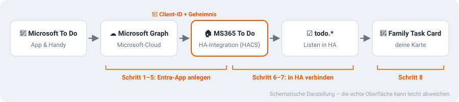
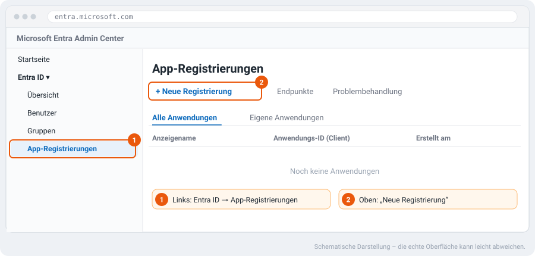
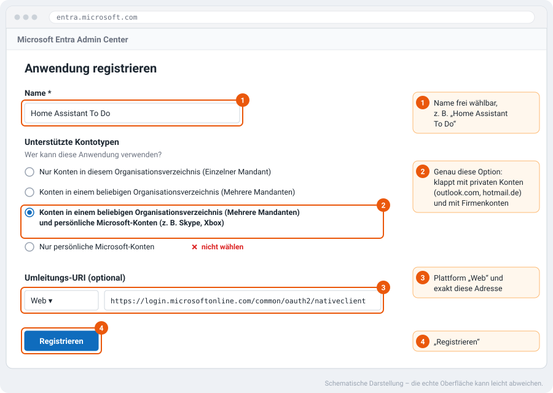
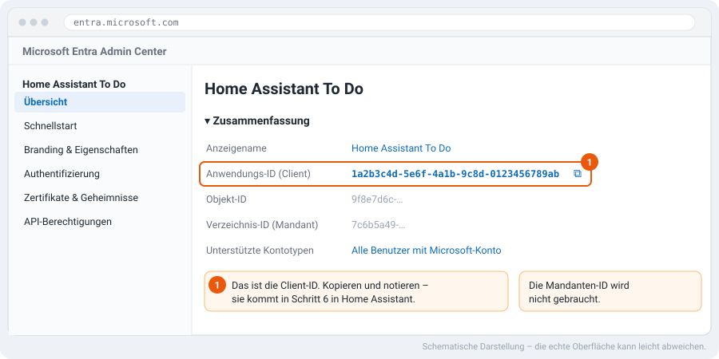
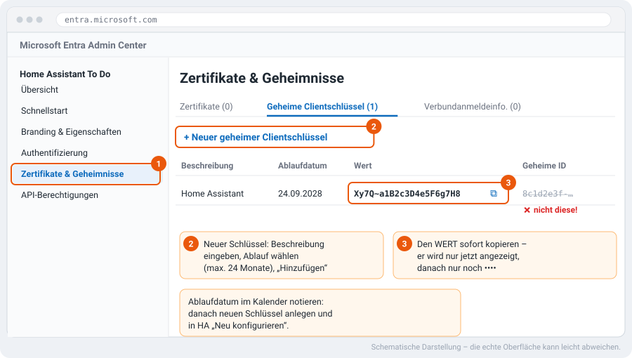
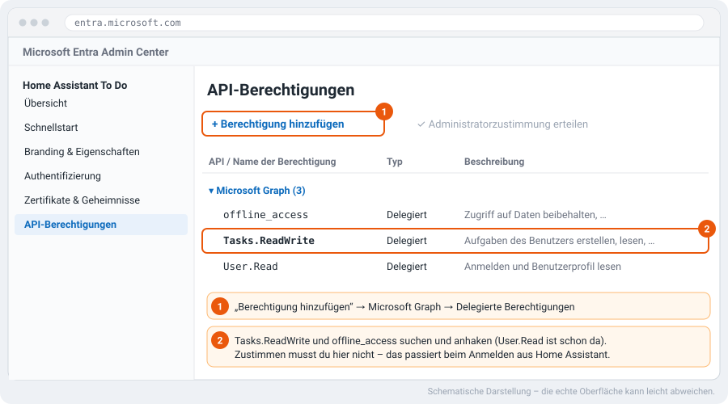
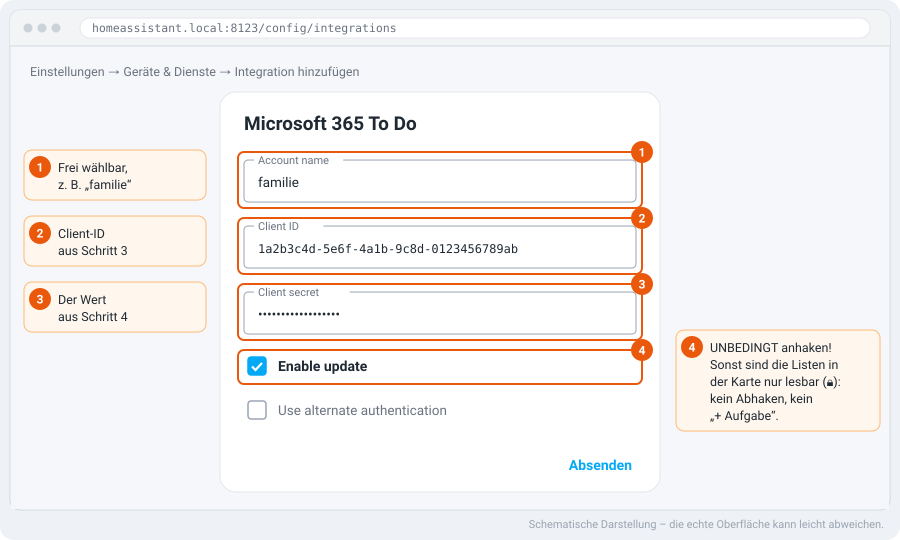
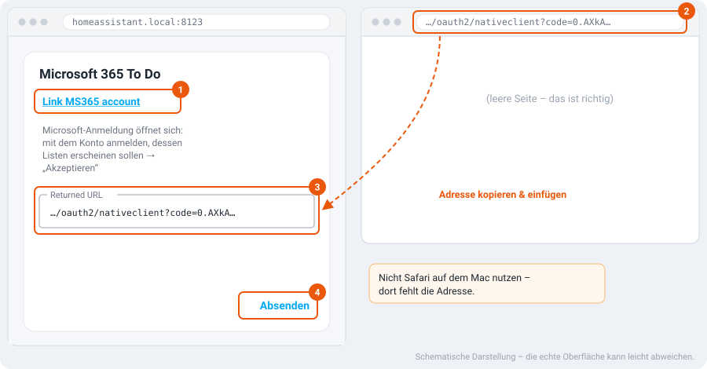

> 🌐 **Deutsch** (diese Seite) · [English](microsoft-todo.md)

# Microsoft To Do mit der Family Task Card

Mit dieser Anleitung erscheinen deine **Microsoft-To-Do-Listen** in der Family
Task Card – mit **Abhaken**, **„+ Aufgabe hinzufügen“** und **Fälligkeiten**.
Änderungen gehen in beide Richtungen: Was du in der Karte abhakst, ist auch in der
To-Do-App am Handy erledigt.

Dauer: etwa **15 Minuten**, einmalig. Der knifflige Teil ist die „Entra-App“ bei
Microsoft (Teil A) – genau dafür sind die Bilder da.



Die Karte selbst spricht nicht mit Microsoft. Die Community-Integration
[**MS365 To Do**](https://github.com/RogerSelwyn/MS365-ToDo) (von RogerSelwyn,
über HACS) holt die Listen in Home Assistant, und die Karte zeigt sie wie jede
andere `todo.*`-Liste an. Damit Microsoft der Integration den Zugriff erlaubt,
braucht sie eine eigene „App-Registrierung“ mit **Client-ID** und **Geheimnis** –
die legst du in Teil A an.

> Die Bilder sind **schematisch** nachgezeichnet. Microsoft ändert sein Portal ab
> und zu; Beschriftungen können leicht abweichen. In der englischen Oberfläche
> heißen die Menüpunkte so wie in Klammern angegeben.

## Was du brauchst

- Ein **Microsoft-Konto** mit To-Do-Listen – privat (outlook.com, hotmail.de,
  live.de) oder ein Firmen-/Schulkonto.
- Zugang zum **Microsoft Entra Admin Center**. Microsoft verlangt für neue
  App-Registrierungen inzwischen ein Entra-Verzeichnis. Mit einem rein privaten
  Microsoft-Konto legst du dafür ein **Azure-Konto** an (laut MS365-Doku
  „Pay-as-you-go“; Entra ID selbst führt Microsoft als kostenlos, für diese
  App-Registrierung fallen normalerweise keine Kosten an).
- **HACS** in Home Assistant.
- Family Task Card **v0.12.0 oder neuer** (ältere Versionen zeigen Aufgaben, die
  heute fällig sind, zu früh als „Überfällig“ an – siehe
  [Fehlerhilfe](#fehlerhilfe)).

---

## Teil A – Entra-App anlegen

### Schritt 1 – Neue App-Registrierung starten

Öffne [entra.microsoft.com](https://entra.microsoft.com) und melde dich an.
Links **Entra ID → App-Registrierungen** (*App registrations*), dann oben
**Neue Registrierung** (*New registration*).



### Schritt 2 – Name, Kontotyp und Umleitungs-URI

1. **Name:** frei wählbar, z. B. `Home Assistant To Do`.
2. **Unterstützte Kontotypen:** die **dritte** Option –
   *„Konten in einem beliebigen Organisationsverzeichnis … und persönliche
   Microsoft-Konten“*. Nur damit funktionieren private Konten **und**
   Firmenkonten. **Nicht** „Nur persönliche Microsoft-Konten“ wählen – damit
   klappt die Anmeldung nicht.
3. **Umleitungs-URI:** Plattform **Web**, Adresse exakt:

   ```text
   https://login.microsoftonline.com/common/oauth2/nativeclient
   ```

4. **Registrieren** (*Register*).



### Schritt 3 – Client-ID notieren

Du landest auf der **Übersicht** (*Overview*) der neuen App. Kopiere die
**Anwendungs-ID (Client)** (*Application (client) ID*) und notiere sie – das ist
deine **Client-ID** für Schritt 6. Die Mandanten-ID brauchst du nicht.



### Schritt 4 – Geheimnis (Client Secret) erzeugen

1. Links **Zertifikate & Geheimnisse** (*Certificates & secrets*).
2. **Neuer geheimer Clientschlüssel** (*New client secret*): Beschreibung eingeben
   (z. B. `Home Assistant`), Ablauf wählen (**höchstens 24 Monate**),
   **Hinzufügen**.
3. **Sofort den „Wert“** (*Value*) kopieren und notieren.

> ⚠️ **Die häufigste Stolperfalle:** Kopiere den **Wert**, nicht die
> **Geheime ID** (*Secret ID*). Der Wert wird **nur jetzt** angezeigt – verlässt
> du die Seite, siehst du nur noch `••••`, und du musst einen neuen Schlüssel
> anlegen.



Trag dir das **Ablaufdatum** in den Kalender ein – siehe
[Pflege](#pflege-wenn-das-geheimnis-abläuft).

### Schritt 5 – Berechtigungen eintragen

1. Links **API-Berechtigungen** (*API permissions*) → **Berechtigung hinzufügen**
   (*Add a permission*) → **Microsoft Graph** → **Delegierte Berechtigungen**
   (*Delegated permissions*).
2. Suchen und anhaken: **`Tasks.ReadWrite`** und **`offline_access`**.
   `User.Read` ist schon eingetragen.
3. **Berechtigungen hinzufügen**.

Zustimmen musst du hier nicht – das passiert beim Anmelden aus Home Assistant
(Schritt 7). Nur bei **Firmenkonten**, in denen Nutzer nicht selbst zustimmen
dürfen, muss ein Admin hier **Administratorzustimmung erteilen**.



**Teil A ist fertig.** Du hast jetzt **Client-ID** und **Geheimnis (Wert)**.

---

## Teil B – In Home Assistant verbinden

### Schritt 6 – Integration installieren und einrichten

1. **HACS** öffnen → nach **„Microsoft 365 To Do“** suchen → **Herunterladen** →
   Home Assistant **neu starten**.
2. **Einstellungen → Geräte & Dienste → Integration hinzufügen** →
   **„Microsoft 365 To Do“**.
3. Ausfüllen:
   - **Account name:** frei wählbar, z. B. `familie` (taucht in den
     Entitätsnamen auf).
   - **Client ID:** aus Schritt 3.
   - **Client secret:** der **Wert** aus Schritt 4.
   - ✅ **Enable update** – **unbedingt anhaken!** Ohne diesen Haken sind die
     Listen nur lesbar: Die Karte zeigt sie mit 🔒, du kannst nichts abhaken und
     es gibt kein „+ Aufgabe“-Feld.
   - *Use alternate authentication* bleibt **aus**.
4. **Absenden**.



### Schritt 7 – Mit Microsoft anmelden

1. Klicke auf **„Link MS365 account“**. Die Microsoft-Anmeldung öffnet sich in
   einem neuen Fenster.
2. Melde dich mit dem Konto an, **dessen Listen erscheinen sollen**, und
   bestätige den Zugriff mit **„Akzeptieren“**.
3. Du landest auf einer **leeren Seite** – das ist richtig. Kopiere die
   **komplette Adresse** aus der Adresszeile (sie beginnt mit
   `https://login.microsoftonline.com/common/oauth2/nativeclient?code=…`).
4. Füge sie in Home Assistant bei **„Returned URL“** ein → **Absenden**.

> **Safari auf dem Mac** zeigt diese Adresse nicht an – nimm für diesen Schritt
> einen anderen Browser (z. B. Chrome, Edge oder Firefox).



**Fertig verbunden.** Für jede To-Do-Liste gibt es jetzt eine `todo.*`-Entität.
Du findest sie unter **Einstellungen → Geräte & Dienste → Entitäten**, Suche
`todo.`.

---

## Teil C – In die Karte (Schritt 8)

Im **Karten-Editor** bei der jeweiligen Person unter **Aufgabenlisten (todo.\*)**
die Microsoft-Liste auswählen. Oder per YAML:

```yaml
type: custom:family-task-card
persons:
  - name: Mama
    person: person.mama
    lists: todo.aufgaben_familie # Microsoft-To-Do-Liste
  - name: Lina
    person: person.lina
    lists: todo.lina_familie
```

Die Entitätsnamen oben sind Beispiele – nimm die, die bei dir unter
`todo.` erscheinen.

**Was funktioniert:**

| | |
|---|---|
| Aufgaben anzeigen | ✅ |
| Abhaken (auch in der To-Do-App erledigt) | ✅ mit *Enable update* |
| „+ Aufgabe hinzufügen“ | ✅ mit *Enable update* |
| Fälligkeit, „Überfällig“, „Bald fällig“ (`due_soon`) | ✅ ganztägig |
| Aufgabe mit **Erinnerung** | ✅ zeigt Datum **und Uhrzeit** der Erinnerung |

Die Integration fragt Microsoft regelmäßig ab. Was du in der To-Do-App am Handy
änderst, erscheint in der Karte daher mit **etwas Verzögerung**.

**Mehrere Microsoft-Konten** (z. B. jedes Kind mit eigenem Konto): Integration
einfach **noch einmal hinzufügen**, mit anderem *Account name*. Die gleiche
Entra-App (Client-ID + Geheimnis) kannst du dafür wiederverwenden.

---

## Fehlerhilfe

| Was passiert | Ursache | Lösung |
|---|---|---|
| Karte zeigt 🔒, kein Abhaken, kein „+ Aufgabe“ | *Enable update* nicht angehakt | Integration **neu konfigurieren** (oder entfernen und neu hinzufügen) und *Enable update* anhaken. |
| Anmeldung: **AADSTS50011** „redirect URI … does not match“ | Umleitungs-URI falsch oder Plattform nicht „Web“ | App → **Authentifizierung**: Plattform **Web**, Adresse exakt wie in Schritt 2. |
| Anmeldung: „… **is not enabled for consumers**“ / `unauthorized_client` | Falscher Kontotyp | App → **Authentifizierung** → Unterstützte Kontotypen: „… und persönliche Microsoft-Konten“ (notfalls neue App mit der richtigen Option anlegen). |
| **AADSTS7000215** „Invalid client secret“ | **Geheime ID** statt **Wert** kopiert – oder Geheimnis abgelaufen | Neuen Schlüssel anlegen, den **Wert** kopieren, Integration neu konfigurieren. |
| Nach der Anmeldung keine Adresse zum Kopieren | Safari auf dem Mac | Anderen Browser nehmen. |
| Firmenkonto mit MFA: Anmeldung hängt | fehlende zweite Umleitungs-URI | Zusätzlich `https://login.microsoftonline.com/organizations/oauth2/v2.0/authorize` als Umleitungs-URI eintragen. |
| Aufgabe „heute fällig“ steht schon als „Überfällig“ da | Karte älter als v0.12.0 | Karte über HACS aktualisieren. |
| Änderungen aus der To-Do-App kommen erst später an | Integration fragt periodisch ab | Kurz warten. |

Mehr zur Integration selbst: [MS365-To-Do-Dokumentation](https://rogerselwyn.github.io/MS365-ToDo/)
und [allgemeine MS365-Doku](https://rogerselwyn.github.io/MS365-HomeAssistant/).

## Pflege: wenn das Geheimnis abläuft

Das Geheimnis aus Schritt 4 gilt **höchstens 24 Monate**. Danach bricht die
Verbindung ab (Fehler **AADSTS7000215**). Rechtzeitig vorher:

1. Entra Admin Center → deine App → **Zertifikate & Geheimnisse** → **neuen**
   Schlüssel anlegen und den **Wert** kopieren.
2. Home Assistant → **Einstellungen → Geräte & Dienste → Microsoft 365 To Do →
   ⋮ → Neu konfigurieren**, neues Geheimnis eintragen, neu anmelden.
3. Den alten Schlüssel im Portal löschen.
