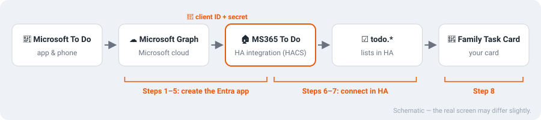
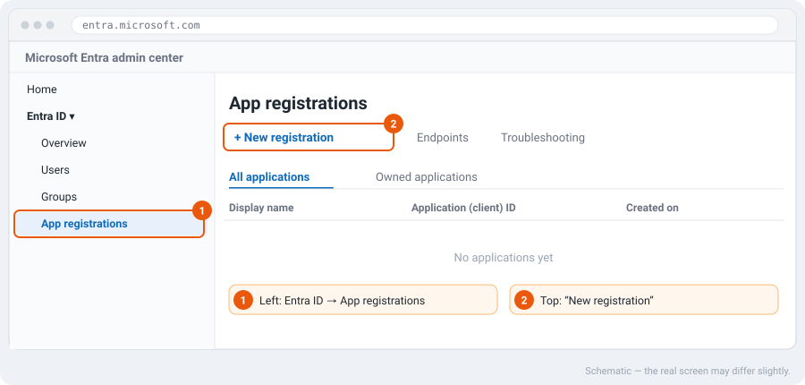
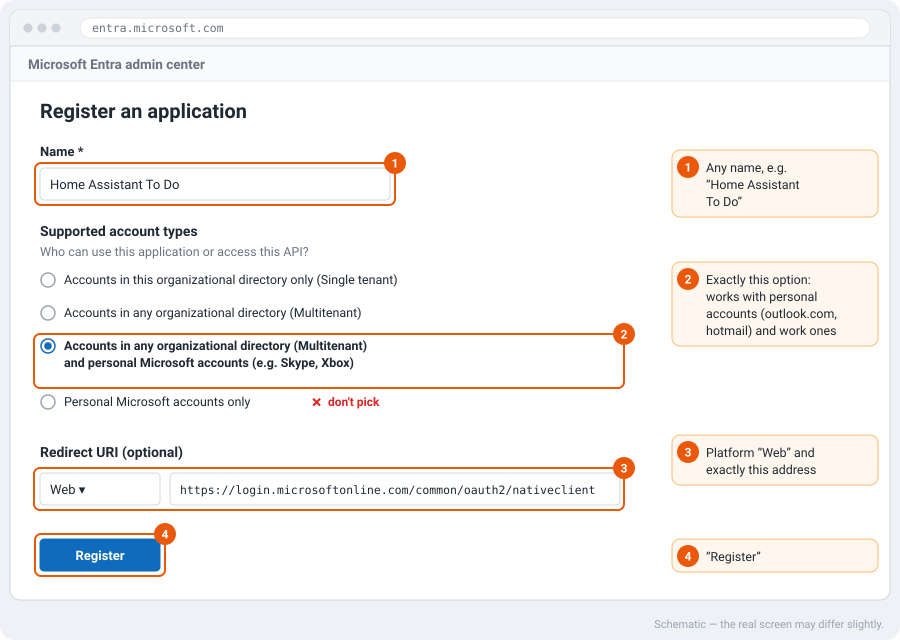
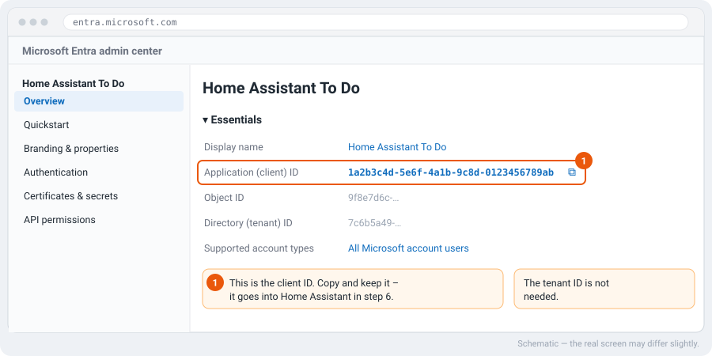
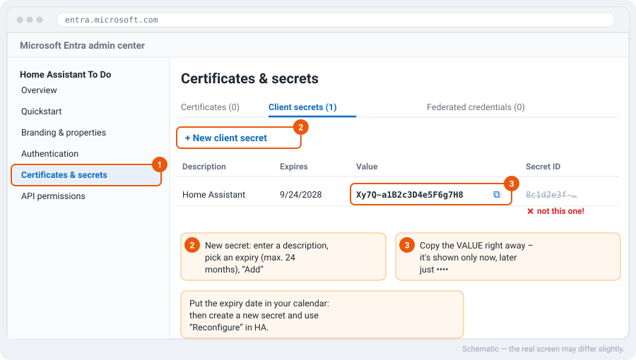
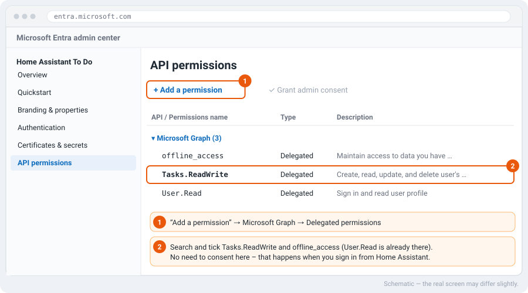
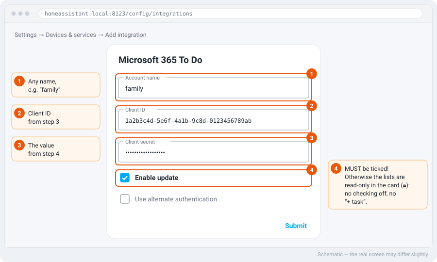
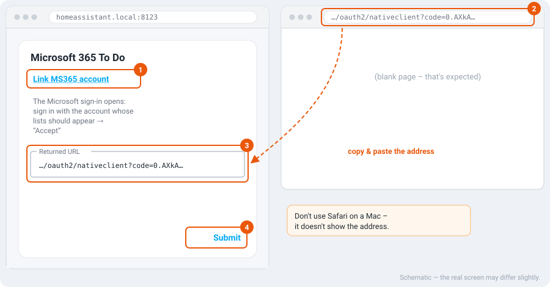

> 🌐 **English** (this page) · [Deutsch](microsoft-todo.de.md)

# Microsoft To Do with the Family Task Card

With this guide your **Microsoft To Do lists** show up in the Family Task Card —
with **checking off**, **"+ add task"** and **due dates**. Changes go both ways:
what you check off in the card is also done in the To Do app on your phone.

Time: about **15 minutes**, once. The tricky part is the "Entra app" at Microsoft
(part A) — that's what the pictures are for.



The card itself doesn't talk to Microsoft. The community integration
[**MS365 To Do**](https://github.com/RogerSelwyn/MS365-ToDo) (by RogerSelwyn,
via HACS) brings the lists into Home Assistant, and the card shows them like any
other `todo.*` list. For Microsoft to let the integration in, it needs its own
"app registration" with a **client ID** and a **secret** — you create that in
part A.

> The pictures are **schematic** redrawings. Microsoft reshuffles its portal now
> and then; labels may differ slightly.

## What you need

- A **Microsoft account** with To Do lists — personal (outlook.com, hotmail.com,
  live.com) or a work/school account.
- Access to the **Microsoft Entra admin center**. Microsoft now requires an Entra
  directory for new app registrations. With a purely personal Microsoft account
  you create an **Azure account** for that (per the MS365 docs "pay-as-you-go";
  Microsoft lists Entra ID itself as free, and this app registration normally
  costs nothing).
- **HACS** in Home Assistant.
- Family Task Card **v0.12.0 or newer** (older versions flag tasks due today as
  "Overdue" too early — see [Troubleshooting](#troubleshooting)).

---

## Part A – Create the Entra app

### Step 1 – Start a new app registration

Open [entra.microsoft.com](https://entra.microsoft.com) and sign in. On the left
**Entra ID → App registrations**, then at the top **New registration**.



### Step 2 – Name, account type and redirect URI

1. **Name:** anything, e.g. `Home Assistant To Do`.
2. **Supported account types:** the **third** option —
   *"Accounts in any organizational directory … and personal Microsoft
   accounts"*. Only this one works for personal **and** work accounts. Do
   **not** pick "Personal Microsoft accounts only" — sign-in will fail with it.
3. **Redirect URI:** platform **Web**, address exactly:

   ```text
   https://login.microsoftonline.com/common/oauth2/nativeclient
   ```

4. **Register**.



### Step 3 – Note the client ID

You land on the new app's **Overview**. Copy the **Application (client) ID** and
keep it — that's your **client ID** for step 6. You don't need the tenant ID.



### Step 4 – Create a client secret

1. On the left **Certificates & secrets**.
2. **New client secret**: enter a description (e.g. `Home Assistant`), pick an
   expiry (**24 months at most**), **Add**.
3. Copy the **Value** **right away** and keep it.

> ⚠️ **The most common pitfall:** copy the **Value**, not the **Secret ID**. The
> value is shown **only now** — once you leave the page you'll only see `••••`
> and have to create a new secret.



Put the **expiry date** in your calendar — see
[Maintenance](#maintenance-when-the-secret-expires).

### Step 5 – Add the permissions

1. On the left **API permissions** → **Add a permission** → **Microsoft Graph** →
   **Delegated permissions**.
2. Search and tick **`Tasks.ReadWrite`** and **`offline_access`**. `User.Read`
   is already there.
3. **Add permissions**.

No need to consent here — that happens when you sign in from Home Assistant
(step 7). Only for **work accounts** where users may not consent themselves, an
admin has to **Grant admin consent** here.



**Part A is done.** You now have the **client ID** and the **secret (value)**.

---

## Part B – Connect in Home Assistant

### Step 6 – Install and set up the integration

1. Open **HACS** → search **"Microsoft 365 To Do"** → **Download** → **restart**
   Home Assistant.
2. **Settings → Devices & services → Add integration** →
   **"Microsoft 365 To Do"**.
3. Fill in:
   - **Account name:** anything, e.g. `family` (it shows up in the entity names).
   - **Client ID:** from step 3.
   - **Client secret:** the **value** from step 4.
   - ✅ **Enable update** — **must be ticked!** Without it the lists are
     read-only: the card shows them with 🔒, you can't check anything off and
     there's no "+ add task" field.
   - *Use alternate authentication* stays **off**.
4. **Submit**.



### Step 7 – Sign in with Microsoft

1. Click **"Link MS365 account"**. The Microsoft sign-in opens in a new window.
2. Sign in with the account **whose lists should appear** and confirm access with
   **"Accept"**.
3. You land on a **blank page** — that's expected. Copy the **full address** from
   the address bar (it starts with
   `https://login.microsoftonline.com/common/oauth2/nativeclient?code=…`).
4. Paste it into **"Returned URL"** in Home Assistant → **Submit**.

> **Safari on a Mac** doesn't show this address — use another browser for this
> step (e.g. Chrome, Edge or Firefox).



**Connected.** Every To Do list now has a `todo.*` entity. Find them under
**Settings → Devices & services → Entities**, search `todo.`.

---

## Part C – Into the card (step 8)

In the **card editor**, pick the Microsoft list under **Task lists (todo.\*)** for
the person. Or in YAML:

```yaml
type: custom:family-task-card
persons:
  - name: Mom
    person: person.mom
    lists: todo.tasks_family # Microsoft To Do list
  - name: Lina
    person: person.lina
    lists: todo.lina_family
```

The entity names above are examples — use the ones that show up under `todo.`
for you.

**What works:**

| | |
|---|---|
| Show tasks | ✅ |
| Check off (also done in the To Do app) | ✅ with *Enable update* |
| "+ add task" | ✅ with *Enable update* |
| Due date, "Overdue", "Due soon" (`due_soon`) | ✅ all-day |
| Task with a **reminder** | ✅ shows date **and time** of the reminder |

The integration polls Microsoft regularly, so changes made in the To Do app on
your phone reach the card **with a short delay**.

**Several Microsoft accounts** (e.g. each kid with their own): just **add the
integration again** with a different *account name*. You can reuse the same
Entra app (client ID + secret).

---

## Troubleshooting

| What happens | Cause | Fix |
|---|---|---|
| Card shows 🔒, no checking off, no "+ add task" | *Enable update* not ticked | **Reconfigure** the integration (or remove and re-add it) and tick *Enable update*. |
| Sign-in: **AADSTS50011** "redirect URI … does not match" | Wrong redirect URI or platform not "Web" | App → **Authentication**: platform **Web**, address exactly as in step 2. |
| Sign-in: "… **is not enabled for consumers**" / `unauthorized_client` | Wrong account type | App → **Authentication** → supported account types: "… and personal Microsoft accounts" (or create a new app with the right option). |
| **AADSTS7000215** "Invalid client secret" | Copied the **Secret ID** instead of the **Value** — or the secret expired | Create a new secret, copy the **value**, reconfigure the integration. |
| No address to copy after signing in | Safari on a Mac | Use another browser. |
| Work account with MFA: sign-in hangs | missing second redirect URI | Also add `https://login.microsoftonline.com/organizations/oauth2/v2.0/authorize` as a redirect URI. |
| A task due today already shows "Overdue" | Card older than v0.12.0 | Update the card via HACS. |
| Changes from the To Do app arrive later | The integration polls periodically | Wait a moment. |

More about the integration itself: [MS365 To Do docs](https://rogerselwyn.github.io/MS365-ToDo/)
and [general MS365 docs](https://rogerselwyn.github.io/MS365-HomeAssistant/).

## Maintenance: when the secret expires

The secret from step 4 is valid for **24 months at most**. After that the
connection stops (error **AADSTS7000215**). In good time before:

1. Entra admin center → your app → **Certificates & secrets** → create a **new**
   secret and copy its **value**.
2. Home Assistant → **Settings → Devices & services → Microsoft 365 To Do → ⋮ →
   Reconfigure**, enter the new secret, sign in again.
3. Delete the old secret in the portal.
